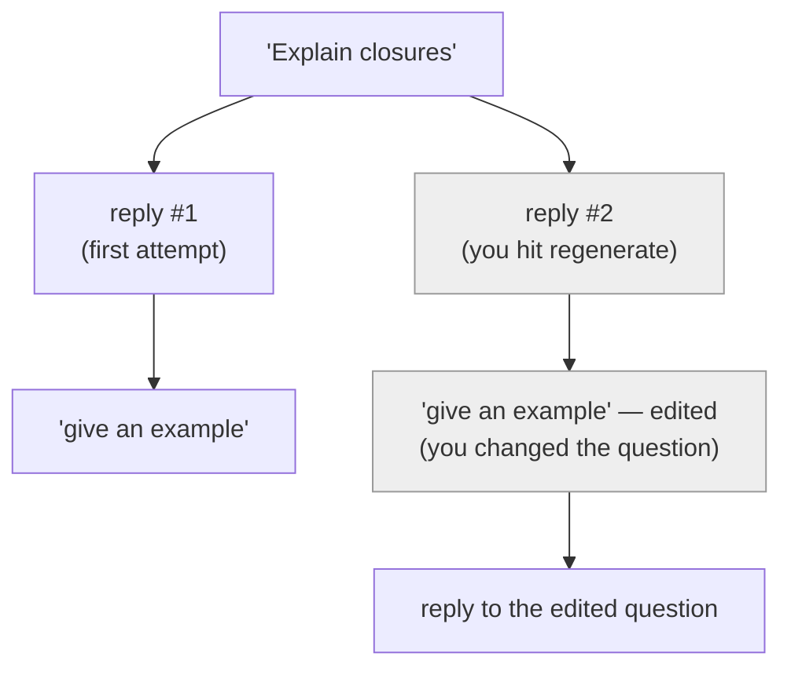
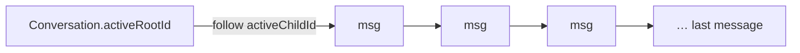
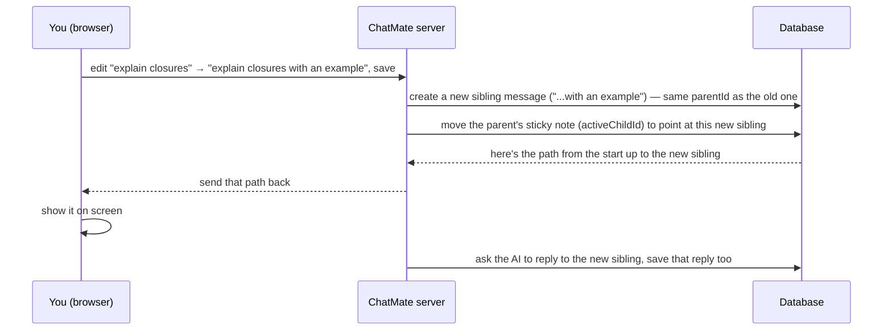
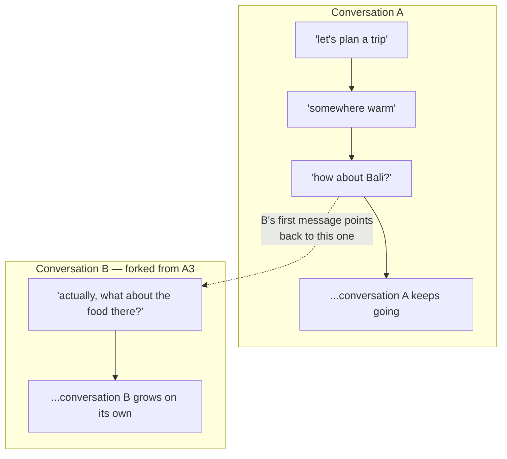
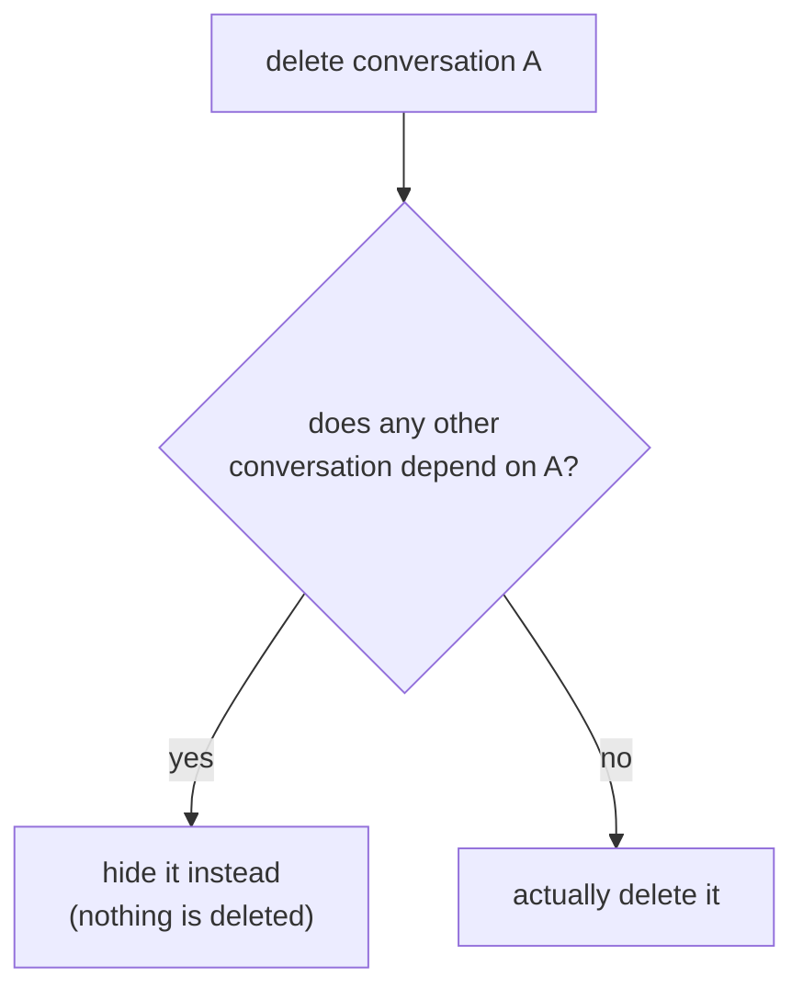

# Branch Implementation

## Why do we need branching?

Think about how a normal chat works. You send a message, the AI replies, you send another message, it replies again. It's just a straight line going down.

Now think about what actually happens when you use ChatGPT for a while. You ask something, the answer is kind of wrong, so you edit your question and try again. Or the answer is fine but you want to see a different version of it, so you hit "regenerate." Or a conversation starts about one thing and halfway through you want to take it in a totally different direction without losing what you already had.

If a conversation is stored as a straight line, none of this works. The moment you edit a message, where does the old one go? If you just delete it and replace it, you've lost it forever — but you might want to go back to it later. If you just add the edited version to the end of the list, the conversation stops making sense, because now there are two messages both pretending to be "message #3."

So we need something that lets a conversation branch — where an old version doesn't get deleted, it just steps aside, and you can jump back to it whenever you want. That's branching.

There are actually two different problems people mean when they say "branching," and this doc covers both:

1. **Editing/regenerating within the same conversation** — you edit message #3, and now there are two "message #3"s (the old one and the new one), and you can flip between them with little arrows, like `‹ 1/2 ›`. The rest of the conversation stays exactly where it was.
2. **Splitting a message off into a whole new conversation** — sometimes editing in place isn't enough, you actually want a brand new chat that still remembers everything up to that point, but grows on its own from there without cluttering the original.

Quick heads-up before we go further, because this trips people up: in the actual code, there's a setting literally called `"inline"` mode for edits — and it does *not* mean "branch within the same conversation." It means the opposite: overwrite the message in place, no branching at all, old reply thrown away. The thing you're picturing when you hear "same-conversation branching" is what the code calls `"branch"` mode. Just a naming collision to keep in the back of your mind — I'll call it out again when we get there.

---

## What is branching, really?

Here's the one-sentence version: **a conversation is not a list, it's a family tree.**

In a family tree, one person can have multiple children. You don't throw away a child to add another one — they just both exist, as siblings. A chat conversation works the exact same way once you store it right: one message can have multiple "replies" (multiple next-messages), and they all just exist side by side as siblings. "Branching" isn't some extra feature bolted on top — it's just... what a tree already does, for free, once you store the conversation as a tree instead of a list.



Two messages up there (`reply #2` and the edited question) are siblings of the ones next to them — same parent, different children. Nothing got deleted. You could click back to the greyed-out ones any time.

So now the real question is just: **how do you store a tree in a normal database table, and how do you know which sibling to actually show on screen right now?** That's everything below.

---

## How it's implemented

### Step 1: Give every message a pointer to its parent

This is the whole foundation, and it's simpler than it sounds. Every message just stores the ID of the message it replied to.

```prisma
model Message {
  id       String  @id @default(cuid())
  content  String
  parentId String?   // the message this one replied to — null if it's the very first message
}
```

That's it — that one column is what turns a flat table of messages into a tree. `parentId` is like the "reports to" field on an org chart: everyone points to exactly one person above them, but any number of people can point to the *same* person above them. Same idea here — any number of messages can share the same `parentId`, and that's exactly what makes them siblings.

### Step 2: Keep track of which sibling is "active" right now

Here's the part people usually miss. Knowing the tree exists isn't enough — when you open a conversation, the app needs to know *which* one of possibly-several siblings to actually show. So we add one more pointer, this time going the other direction (parent → "which of my children is the one that's currently showing"):

```prisma
model Message {
  id            String  @id @default(cuid())
  parentId      String?
  activeChildId String? @unique   // of this message's children, which one is on screen right now
}

model Conversation {
  id           String   @id @default(cuid())
  activeRootId String?  @unique   // same idea, but for the very first message
}
```

Think of `activeChildId` like a sticky note on top of a stack of drafts: it doesn't say anything about which draft is "best," it just says "this is the one I'm currently looking at." Switching branches later is just moving the sticky note to a different draft — nothing gets copied, nothing gets deleted, you're just changing which one the note is stuck to.

`Conversation.activeRootId` is the exact same idea, just one level higher — because even the *first* message in a conversation can have siblings (you can edit your very first question too), so the conversation itself needs a sticky note pointing at which "first message" is the active one.

One important detail: `activeChildId` does **not** automatically mean "the newest child." It's a real decision, stored deliberately. If it just meant "whatever was created last," then switching back to an older branch and refreshing the page would silently snap you back to the newest one — which isn't what you asked for. So every time you create a branch or switch to one, this pointer gets updated on purpose, not inferred.

### Step 3: Reading a conversation = following the sticky notes

Now that the pointers exist, showing a conversation on screen is genuinely simple: start at the conversation's `activeRootId`, and just keep following `activeChildId` until you run out.



```ts
const path = [];
let currentId = conversation.activeRootId;

while (currentId) {
  const message = allMessages.get(currentId);
  if (!message) break;
  path.push(message);
  currentId = message.activeChildId; // keep following the sticky notes
}
```

That's the entire "load a conversation" algorithm. No recursion, no complicated tree traversal — just "follow the pointer, follow the pointer, follow the pointer" until there isn't one left.

While we're walking through, we also quietly note down each message's siblings (anyone else sharing its `parentId`) — that's what lets the little `‹ 2/3 ›` arrows show up in the UI without a second trip to the database.

### Step 4: Saving a message = pointing it at whatever came before it

Saving works the same way in reverse. You're given a list of messages from oldest to newest, and for each new one, its parent is just "whatever message came right before it in that list":

```ts
let previousId = null;

for (const message of messages) {
  if (isNew(message)) {
    await createMessage({ ...message, parentId: previousId });

    if (previousId) {
      // move the sticky note: "this new message is now the active child"
      await updateMessage(previousId, { activeChildId: message.id });
    }
  }
  previousId = message.id;
}
```

The nice thing about writing it this way: this exact same function handles a normal new message *and* the aftermath of creating a branch, with zero special-casing. It doesn't need to know "is this a fresh conversation or did we just branch off something" — it just looks at the order of the list it was handed and connects the dots.

### Step 5: Editing and regenerating — the "same conversation" branching

Now we can actually build the two things people usually mean by "branching."

**Editing a message:** say you asked "explain closures" and want to reword it. Instead of overwriting message #3, you create a brand new message with the *same* `parentId` as the old one — a sibling — then move the sticky note on the parent to point at the new one instead.



The old "explain closures" message is never touched. It's just not where the sticky note points anymore — which is exactly why you can click `‹ 1/2 ›` and go back to it whenever you want.

**Regenerating a reply** works the same way, just for the AI's message instead of yours: leave the old reply exactly where it is, create a new sibling reply, move the sticky note.

**Switching between branches** is the simplest of all three — you're not creating anything, you're just moving one sticky note (`activeChildId`, or `activeRootId` if it's the very first message) to point at a different existing sibling.

> **Quick reminder on naming**, since I flagged this earlier: everything in this step is what the code calls `"branch"` mode — create a sibling, keep the old one around. There's a *separate*, narrower setting called `"inline"` mode that does the opposite on purpose (overwrite in place, throw the old reply away, no sibling, no branch) — that one exists for a "just fix it, I don't care about keeping the old version" use case. Don't let the word "inline" make you think it means "branch within the same conversation" — in the code it means the exact opposite.

### Step 6: Forking — the "brand new conversation" branching

Sometimes editing in place isn't what you want. Sometimes a conversation genuinely splits into two different topics, and you'd rather have a second, separate conversation in your sidebar — but one that still remembers everything up to the point where it split off.

The tempting, wrong way to build this: copy every message up to that point into a new conversation. It works, but now you've doubled your storage for no real reason, and if you ever fix a typo in the original, the copy doesn't know about it.

The better way: don't copy anything. Just let the new conversation's very first message point its `parentId` at the message you forked from — the exact same pointer from Step 1, just now pointing at a message that happens to live in a *different* conversation.



Nothing stops a message's `parentId` from pointing at a message in a different conversation — that was never actually a rule enforced by the database, just something we happened to assume until now. Forking is just... not assuming it anymore.

**Reading it back:** when you open the forked conversation, the app needs to show you the history it inherited. So it does the Step 3 walk, but backwards — starting at the message it was forked from, and following `parentId` upward instead of `activeChildId` downward, even when that walk crosses into a different conversation:

```ts
async function getInheritedHistory(messageId) {
  const chain = [];
  let cursor = messageId;
  while (cursor) {
    const message = await findMessage(cursor);
    if (!message) break;
    chain.push(message);
    cursor = message.parentId; // this might belong to a completely different conversation
  }
  return chain.reverse();
}
```

This inherited history is shown read-only, right above the new conversation's own messages — think of it like a "previously, on..." recap. It's re-fetched fresh every time, never copied and stored, so the original conversation stays the single source of truth for it.

**One thing to watch out for:** deleting the original conversation would normally cascade-delete every message under it — including, now, the message a fork is hanging off of. Delete that, and the forked conversation loses its history out from under it. So before deleting a conversation, we check: does anything depend on one of my messages as its starting point? If yes, don't actually delete it — just hide it from the list instead, like putting a box in the attic instead of the trash. Everything stays intact; you just don't see it in your sidebar anymore. Once the last thing depending on it is itself deleted, it finally gets cleaned up for real.



---

## A couple of things worth knowing if you build this yourself

- **Overwrite-in-place edits (`"inline"` mode) and forking don't mix safely without a check.** If you overwrite a message and it happens to be something another conversation forked from, you'd be deleting history out from under that fork. Worth checking for that before an overwrite goes through, the same way we check before deleting a whole conversation.
- **Always assume a chain could loop back on itself**, even though nothing should ever cause that on purpose. Any time you're following pointers in a `while` loop (Step 3, or the upward walk in Step 6), keep track of what you've already visited and stop if you see it again — cheap insurance against a rare bug turning into an infinite loop.

---

## The one idea underneath all of it

Every piece of this comes down to the same trick, just applied at a bigger and bigger scope:

> **Don't copy what's active. Just point at it.**

- Within one message: `activeChildId` points at which reply is showing.
- Within one conversation: `activeRootId` points at which first-message is showing.
- Across conversations: `forkedFromMessageId` points at where a whole new conversation grew from.

Same idea, three sizes. Once that clicks, the rest of this doc is really just "here's where we wrote that idea down as a database column."